# Data-Driven Sequential Decision-Making for Small Hydro Propeller Turbine Performance Testing: Bayesian Optimization and Active Learning for Experiment Reduction

> **Editing note (for co-authors).** This Markdown file mirrors `elsarticle-template-num.tex`
> for easy editing and conversion to `.docx` (`pandoc paper.md -o paper.docx`).
> The LaTeX file is the submission master; keep the two in sync. Figures live in
> `../result/` (study output) and `img/` (test-rig photo). Numbers here match
> `result/table_n12.csv` and `result/wilcoxon_n12.csv`.

**Siwakorn Suprasertchai¹, Kornpaphop Ruttanawijit², Yodchai Tiaple¹\***

¹ Department of Maritime Engineering, Faculty of International Maritime Studies, Kasetsart University, Sriracha Campus, Chonburi, Thailand
² Department of Energy Technology, Faculty of Engineering and Industry Technology, Rambhai Barni Rajabhat University, Thailand
\* Corresponding author: yodchai.ti@ku.th

## Abstract

Constructing the efficiency map (hill chart) of a hydraulic turbine and locating its best efficiency point (BEP) requires many physical experiments, each costly in both time and labor. Existing approaches either couple surrogate models to CFD-based geometric design or fit models to pre-collected test data under a fixed sampling plan; the use of an adaptive policy to decide which physical experiments to run, benchmarked against classical design of experiments on real measurements, remains unaddressed. This work frames performance testing as a sequential decision problem and compares six sampling policies: Bayesian optimization with an upper-confidence-bound acquisition (BO-UCB), two Gaussian-process active-learning policies (ALM and ALC), and random, grid, and Latin hypercube sampling. Sweeping the experimental budget from 6 to 30 points over 20 random seeds, we evaluate every policy against a 72-point baseline measured on a 137 kW small-hydro propeller turbine. For reconstructing the full hill chart the active learners dominate: ALC reaches *R²* = 0.996 and MAPE = 0.35% from only 12 experiments (an 83.3% reduction), whereas BO-UCB is the weakest at reconstruction (*R²* = 0.921). For locating the BEP the ranking inverts: BO-UCB identifies the exact BEP node (*Q* = 0.8185 m³/s, *H* = 16.00 m, *η*\* = 0.6973) on every seed from 14 experiments (an 81% reduction), while all other policies plateau near Δ*η* ≈ 10⁻². Every separation is confirmed by paired Wilcoxon signed-rank tests. These results show that the acquisition function must match the deliverable: global fit is the wrong success metric for BEP-directed testing, and BEP-directed sampling is the wrong tool for building the map.

**Keywords:** Bayesian optimization; sequential experimental design; small hydropower; propeller turbine; surrogate modeling; active learning

**Highlights**
- Turbine performance testing is framed as a budget-constrained sequential decision problem.
- Six sampling policies are benchmarked on 72 real propeller-turbine measurements.
- Active learning reconstructs the full hill chart to *R²* ≈ 0.996 using only 12 of the 72 test points.
- Bayesian optimization locates the exact best efficiency point from only 14 test points.
- The two objectives select opposite winners; the sampler must match the deliverable.

---

## 1. Introduction

### 1.1 Background and motivation

Small hydropower remains one of the most mature and dispatchable sources of renewable electricity, and propeller-type reaction turbines are widely deployed in run-of-river and low-head installations where the available head is modest but the flow is comparatively large. The operational value of such a machine is governed by its efficiency characteristic over the full envelope of discharge and head at which it is expected to run. This characteristic is summarized by the efficiency map, or hill chart, which expresses turbine efficiency as a function of the principal operating variables and locates the best efficiency point (BEP) — the operating condition at which the machine converts the available hydraulic power into shaft power most effectively. Accurate knowledge of the hill chart and of the BEP underpins site matching, control-system tuning, performance guarantees, and condition monitoring throughout the service life of the unit.

Constructing a reliable hill chart from physical measurements is expensive. Each test point requires the rig to be brought to a stable operating condition, the instrumentation to settle, and repeated readings to be averaged, all under controlled procedures. A densely sampled map of the kind used as ground truth in the present study — comprising several dozen individual operating points across the discharge–head plane — represents a substantial commitment of test-rig time, energy, and labor. In commercial and research settings alike, this cost places a practical ceiling on how finely the operating envelope can be characterized, and it motivates a question that is fundamentally one of resource allocation: given a limited budget of physical experiments, which operating points should be measured so that the quantities of engineering interest are recovered as accurately as possible? Propeller and other reaction turbines are the dominant choice in the low- and ultra-low-head range, where compact run-of-river installations are increasingly important for distributed renewable generation [1], and small-hydro units of this class have been deployed and characterized in run-of-river settings in Thailand [2]. Standardized model- and prototype-acceptance testing of such machines follows international codes [3], whose controlled procedures are precisely what make each measured operating point costly.

### 1.2 The decision problem in turbine performance testing

The question above is best framed not as a curve-fitting problem but as a sequential decision-making problem under expensive evaluation. At each stage of a test campaign, the engineer has already observed efficiency at a set of operating points and must decide where to run the next experiment. The decision is made under uncertainty, because the efficiency at untested conditions is unknown, and it is made under a budget constraint, because every additional experiment consumes scarce resources. A good decision policy allocates the limited budget to the points that are most informative for the goal at hand, rather than spreading effort uniformly across a region of the operating envelope that may be of little practical interest. This framing matters because the goal of a test campaign is frequently not to reconstruct the entire efficiency surface with uniform fidelity, but to determine the operationally decisive quantities — above all the location and value of the BEP and the shape of the high-efficiency region around it. A test plan optimized for uniform global accuracy and a test plan optimized for locating the BEP are not the same plan, and confusing the two can lead an otherwise careful study to measure the wrong points. Recognizing turbine performance testing as a targeted, budget-constrained decision process, rather than a passive data-collection exercise, is the conceptual starting point of this work.

### 1.3 Research gap

Data-driven and surrogate-based methods for reducing the number of evaluations in turbine engineering are now well established, but the existing literature addresses a different problem from the one posed here. The dominant body of work couples surrogate models — Gaussian process regression, polynomial response surfaces, or neural networks — to computational fluid dynamics (CFD) and uses them to accelerate the geometric design of runners and blades, validating the surrogate against further CFD rather than against physical measurements [4]. These studies typically operate over a small number of geometric design variables and treat the expensive evaluation as a simulation, not a laboratory test. A second, more recent strand applies machine learning to experimental turbine data to predict efficiency, but it fits models to data that have already been collected and does not use the model to decide which experiments to run; the sampling plan is fixed in advance [5]. Classical design of experiments in turbine work — central composite designs, factorial designs, Latin hypercube designs — is likewise specified before any testing begins and is non-adaptive [6]. What is absent is a study that treats the construction of a turbine performance map from real physical experiments as an adaptive, budget-constrained decision process, and that benchmarks an adaptive policy against the classical fixed designs on the specific task of locating the BEP. The present work addresses this gap directly. It uses a measured ground-truth dataset for a small-hydro propeller turbine, frames test-point selection as sequential decision-making, and compares adaptive Gaussian-process policies — Bayesian optimization and two active-learning designs — against random, grid, and Latin hypercube sampling across a sweep of experimental budgets, with both the full hill chart and the BEP as explicit decision targets.

### 1.4 Contributions and organization

1. We formulate the construction of a small-hydro propeller-turbine performance map as a sequential, budget-constrained decision problem with two distinct objectives — uniform surface reconstruction and best-efficiency-point identification — and we make explicit why these objectives demand different sampling strategies and different success metrics.
2. We benchmark six sampling policies — a Bayesian optimization (BO-UCB) policy, two Gaussian-process active-learning policies (ALM and ALC), and three classical design-of-experiments baselines (random, grid, and Latin hypercube sampling) — on a measured ground-truth dataset of 72 physical experiments, sweeping the budget from 6 to 30 experiments and evaluating every policy across 20 random seeds so that the comparison reflects expected behavior rather than a single fortunate run.
3. We show that the two objectives select opposite winners. The active learners reconstruct the full hill chart to *R²* ≥ 0.99 from as few as 10 experiments and to *R²* ≈ 0.996 at 12 (an 83.3% reduction), while the Bayesian policy is the weakest map-builder; conversely, the Bayesian policy locates the exact BEP node on every seed from 14 experiments (an 81% reduction), while every other policy plateaus near Δ*η* ≈ 10⁻². We confirm each separation with paired Wilcoxon signed-rank tests and argue that global accuracy is the wrong success criterion for a BEP-directed campaign.
4. We quantify the achievable experiment reduction through a budget sweep from 6 to 30 experiments, identify the very-low-budget regime (*n* < 8) in which model-based policies degrade and space-filling designs are the safer choice, and derive tiered practical guidance that matches the sampling policy to the deliverable.

The remainder of the paper is organized as follows. Section 2 reviews surrogate and machine-learning models for turbine performance, classical design of experiments, and Bayesian optimization as a framework for adaptive experimental design, and positions the present work against the closest prior art. Section 3 formulates the performance-mapping task as a sequential decision problem and defines the decision objective. Section 4 describes the experimental dataset, the Gaussian-process surrogate and the adaptive sampling policies, the initialization, the baseline designs, and the evaluation protocol. Section 5 reports the results. Section 6 discusses the findings, their decision-support implications, and the limitations of the study, and concludes.

## 2. Related Work

### 2.1 Surrogate and machine-learning models for turbine performance maps

Surrogate modeling has become a standard tool for reducing the computational cost of turbine analysis and design. The representative contribution in the hydropower context is the machine-learning surrogate of Masood et al. [4], who coupled a Gaussian process model to CFD to accelerate the simulation-driven optimization of a Kaplan turbine runner. Their surrogate is trained on CFD evaluations over a parametric geometric design space and is validated against further CFD; the reported outcome is a substantial improvement in the efficiency of the optimized design relative to the baseline geometry, achieved at a fraction of the computational cost of exhaustive simulation. This work is emblematic of a large family of studies in which the expensive evaluation is a numerical simulation, the design variables describe machine geometry, and the validation reference is itself computational. The objective in these studies is design improvement, not the empirical characterization of an existing machine from laboratory measurements. A more recent line of work brings machine learning to bear on experimental turbine data. Besni et al. [5] developed machine-learning models to predict the efficiency of Francis-type hydraulic turbines using data obtained from comprehensive model-acceptance performance testing, combining experimental and numerical information in the predictive model. This is closer in spirit to the present study because the data are physical measurements rather than simulations. The decisive difference is that the predictive model is fitted to a sampling plan that has been fixed in advance; the model does not participate in deciding which operating points to test, and the number of experiments is not itself the object of optimization. The same observation applies to the broader literature on efficiency-map and hill-chart fitting, in which measured points are interpolated or regressed after the fact to yield a continuous characteristic. Beyond these representative cases, a rapidly growing body of work applies machine learning to the performance characterization of hydraulic machines. Data-driven models have been used to predict the best-efficiency operating point and the complete performance curves of pumps operating as turbines [7,8], and to estimate turbine power output directly from operating data [9]. The broader role of artificial intelligence in turbomachinery design, validation, and condition monitoring — including Gaussian-process surrogates and Bayesian optimization — has recently been surveyed [10], and hybrid schemes that combine neural networks with physics-based off-design analysis illustrate the same trend in adjacent turbomachinery [11]. In every case the surrogate is fitted to a predetermined dataset; it does not decide which experiments to perform.

### 2.2 Classical design of experiments in turbine experimentation

Design of experiments (DOE) provides the classical toolkit for choosing where to sample an input space when each observation is costly. In turbine and pump research the dominant approach is response surface methodology [12] built on central composite designs, which place experimental points at factorial corners, axial points, and a center point to support the fitting of a second-order polynomial model. Betancour et al. [6], for example, used a central composite design to optimize the runner of a gravitational vortex turbine, monitoring the response through CFD and validating the optimum experimentally; comparable central composite designs appear throughout the pump-as-turbine and mixed-flow literature. Latin hypercube sampling, introduced by McKay et al. [13], is the other widely used design, valued for its space-filling properties and its even projection of points onto each input dimension. Full or fractional factorial grids and uniform random sampling complete the set of conventional choices. The defining feature of all of these designs is that they are non-adaptive: the complete set of sampling locations is determined before any measurement is taken, using only prior knowledge of the input ranges and no information from the responses themselves. This is appropriate when the goal is to characterize the whole input space uniformly or to fit a low-order global model, and it is the reason space-filling designs perform strongly on global reconstruction metrics. It is less appropriate when the goal is concentrated on a particular feature of the response, such as the location of an optimum, because the budget is spent uniformly rather than where the feature lies. Recent applications confirm the continued prevalence of these designs in energy and turbomachinery engineering: central composite designs coupled to computational fluid dynamics have been used to optimize turbine-duct geometry [14]. To soften the strictly non-adaptive nature of classical space-filling designs, adaptive Latin hypercube schemes have been proposed that add samples sequentially in regions of high surrogate deviation [15]; such schemes move partway toward the adaptive policy studied here while remaining variance-driven rather than objective-driven.

### 2.3 Bayesian optimization and adaptive experimental design

Bayesian optimization (BO) is a framework for the sequential, model-based optimization of expensive black-box functions [16,17]. It maintains a probabilistic surrogate of the unknown function — most commonly a Gaussian process [18] — and uses an acquisition function derived from the surrogate's posterior to decide where to evaluate next, balancing exploitation of regions believed to be near-optimal against exploration of regions where the surrogate is uncertain. The Expected Improvement criterion of Jones et al. [16] and the upper-confidence-bound family [19] are the canonical acquisition functions, and the approach has been applied across machine-learning hyperparameter tuning [20] and a wide range of engineering design tasks. Of particular relevance here is the use of BO not for optimization per se but as a policy for adaptive experimental design. Greenhill et al. [21] review this perspective explicitly, framing BO as an automated decision policy for choosing experiments and contrasting it with classical fixed designs; benchmark studies in experimental materials science [22] likewise compare BO against space-filling and random designs across diverse real datasets. The consistent finding across this literature is that adaptive policies excel when the objective is to find an optimum efficiently, precisely because they deliberately concentrate sampling near the optimum and decline to spend budget on uninformative regions — at the expense of global model accuracy. This exploitation behavior is central to interpreting the results of the present study. Within fluid machinery specifically, Bayesian optimization and Gaussian-process surrogates have been applied to one-dimensional turbomachinery design through transfer learning [23], to multi-objective aerodynamic shape optimization of airfoils [24], to coupled aerodynamic and aeroacoustic blade design [25], and to high-dimensional aero-structural compressor-blade design [26]. More generally, active-learning strategies that construct surrogate models with the fewest possible expensive evaluations [27] share the objective-directed sampling philosophy adopted here. These applications are predominantly simulation-based and geometry-oriented; their adaptation to the selection of physical operating points on a measured turbine, with the BEP as the explicit target, is the contribution of the present work.

### 2.4 Positioning of the present work

Table 1 positions the present study against the closest prior art along four axes: the nature of the data, the method, the optimization target, and whether the approach is benchmarked against classical designs. The combination addressed here — physical experimental data, adaptive Gaussian-process policies (Bayesian optimization and active learning) benchmarked against random, grid, and Latin hypercube designs, on a small-hydro propeller turbine, with the BEP as the explicit target — does not appear in the existing literature. The present work does not claim to be the first application of Bayesian optimization to a turbine; it claims novelty in this specific combination and, more importantly, in the decision-level finding that the sampling policy must be matched to the deliverable: exploitation-driven sampling wins for BEP identification despite inferior global metrics, while uncertainty-driven active learning wins for hill-chart reconstruction.

**Table 1. Positioning relative to the closest prior work.**

| Study | Data source | Method | Target | Benchmarked vs. classical DOE |
|---|---|---|---|---|
| Masood et al. (2021) | CFD | GP surrogate + optimization | Runner geometry design | No |
| Besni et al. (2025) | Experiment (model test) | ML efficiency prediction | Efficiency prediction | No |
| Betancour et al. (2023) | CFD + experiment | RSM / CCD | Runner geometry design | Single design family |
| Greenhill et al. (2020) | Various (review) | BO / adaptive design | Generic optimization | Conceptual |
| **This work** | **Experiment (test rig)** | **Adaptive GP policies (BO, ALM, ALC)** | **BEP localization + map** | **Random, Grid, LHS** |

## 3. Problem Formulation

### 3.1 Performance map and best efficiency point

Let the operating condition of the turbine be described by the discharge *Q* and the head *H*, and let *η*(*Q*, *H*) denote the measured efficiency at that condition. The performance map is the function *η* defined over the feasible operating domain *X*, a subset of the (*Q*, *H*) plane, which in the present study spans *Q* ∈ [0.791, 1.123] m³/s and *H* ∈ [15, 22] m. The best efficiency point is the maximizer of efficiency over this domain:

> (*Q*\*, *H*\*) = argmax over (*Q*, *H*) ∈ *X* of *η*(*Q*, *H*),  *η*\* = *η*(*Q*\*, *H*\*).  **(1)**

In the measured ground-truth dataset the BEP is located at *Q* = 0.8185 m³/s, *H* = 16.00 m (guide-vane angle 37.5°), with *η*\* = 0.6973, in the low-discharge, low-head corner of the envelope where the efficiency ridge is highest. The efficiency surface is smooth and unimodal in the high-efficiency region, with a single broad ridge descending toward a low-efficiency corner at high discharge (efficiency falling to 0.497); this structure is typical of low-head propeller machines. Figure 2 presents the measured efficiency surface of this turbine in three dimensions, and Figure 3 shows the same data as a contour map of the discharge–head plane with the BEP marked.

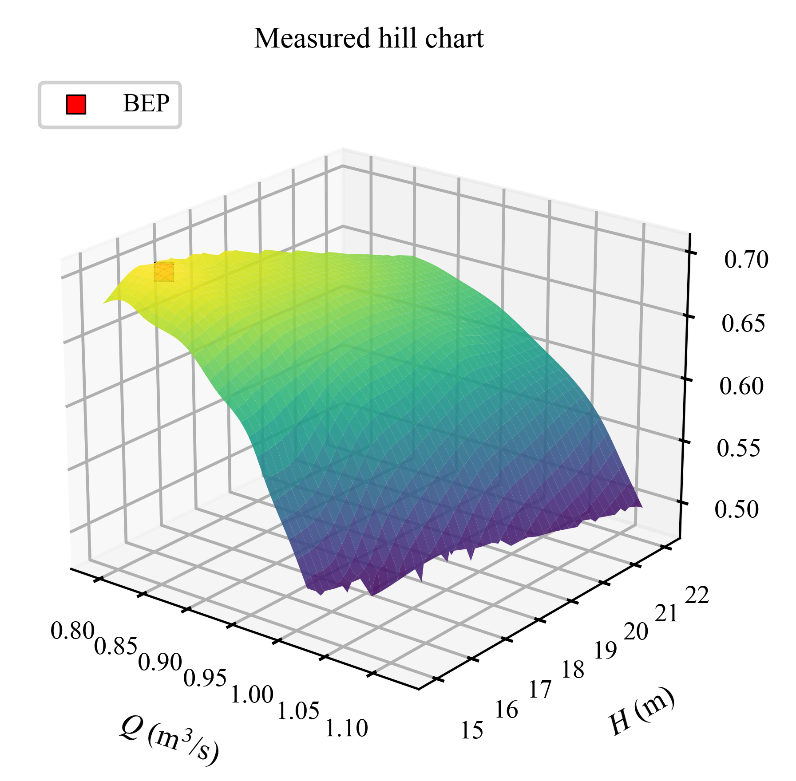

**Figure 2.** Measured ground-truth efficiency surface of the 137 kW propeller turbine (72 experimental points) in the discharge–head plane.

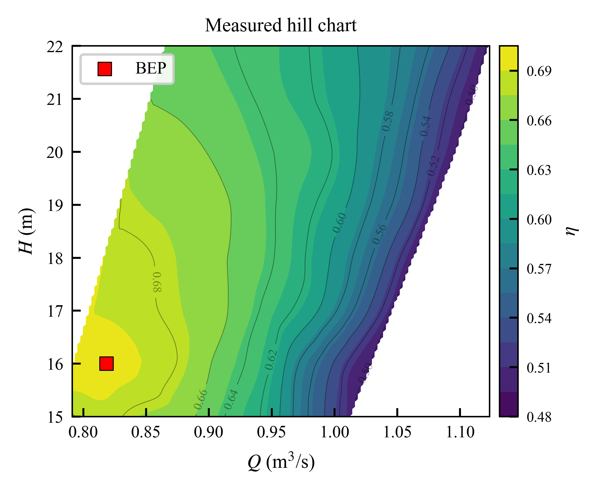

**Figure 3.** Measured ground-truth efficiency contour map with the experimental points and the best efficiency point (BEP).

The true function *η* is observable only through physical experiments. Each experiment at a chosen condition (*Q*ᵢ, *H*ᵢ) returns a measurement *y*ᵢ = *η*(*Q*ᵢ, *H*ᵢ) + *e*ᵢ, where *e*ᵢ captures measurement and repeatability error. Experiments are expensive, so the number that can be performed is limited to a budget *N* that is small relative to the resolution at which the map would ideally be known.

### 3.2 Sequential decision formulation

We cast the construction of the performance map as a sequential decision problem. After *t* experiments the state is the set of observed condition–efficiency pairs *D*ₜ = {(*Q*ᵢ, *H*ᵢ, *y*ᵢ)} for *i* = 1..*t*. An action is the choice of the next operating condition (*Q*ₜ₊₁, *H*ₜ₊₁) ∈ *X* at which to run an experiment; each operating point is specified by (*Q*, *H*), which fixes the corresponding guide-vane setting on the test manifold. A policy *π* is a rule that maps the current state to the next action, (*Q*ₜ₊₁, *H*ₜ₊₁) = *π*(*D*ₜ). The process begins from an initial design of *n*₀ points and proceeds until the budget *N* is exhausted. This formulation unifies the methods compared in this paper. The classical designs correspond to non-adaptive policies whose actions do not depend on the observed efficiencies: random sampling draws each condition independently from *X*, grid sampling places conditions on a fixed lattice, and Latin hypercube sampling selects a space-filling set with even one-dimensional projections. Bayesian optimization corresponds to an adaptive policy: it maintains a surrogate model of *η* given *D*ₜ and chooses each action by maximizing an acquisition function that depends on the surrogate's posterior mean and variance, so that the next experiment is selected in light of everything observed so far. The distinction between non-adaptive and adaptive policies is the central methodological variable of the study.

### 3.3 Decision objective and the inadequacy of global fit

The choice of objective determines which policy is good. Two objectives must be distinguished. The first is global reconstruction: to recover the entire surface *η* over *X* with uniform accuracy, measured by aggregate error statistics such as the mean absolute error or the coefficient of determination computed over the whole domain. The second is BEP identification: to determine (*Q*\*, *H*\*) and *η*\*, and to characterize the high-efficiency region around the optimum, as accurately as possible within the budget. These objectives are not aligned. A policy optimized for global reconstruction spreads its budget evenly and is rewarded for accuracy in regions of the operating envelope — such as the low-efficiency, high-discharge corner — that are of little operational interest. A policy optimized for BEP identification concentrates its budget near the optimum and is content to model the uninteresting regions poorly. Consequently, the global error of a BEP-directed policy can be large even when its localization of the optimum is exact, and conversely a space-filling design can achieve excellent global error while placing no experiments close enough to the true optimum to resolve it precisely. The results of Section 5 demonstrate exactly this reversal. It follows that global reconstruction metrics are the wrong success criterion for a BEP-directed campaign. We therefore evaluate every policy under both objectives — global reconstruction metrics for the hill chart and localization error for the BEP — and rank each policy only under the objective it is designed to serve. The formal definitions of these metrics are given in Section 4.5.

## 4. Methodology

### 4.1 Experimental dataset and test rig

The ground-truth dataset consists of 72 measured operating points for a small-hydro propeller turbine, organized as eight constant-head test series at heads of 15, 16, 17, 18, 19, 20, 21, and 22 m, each comprising a sweep of guide-vane openings and the corresponding discharge. The measured variables at each point are the guide-vane angle, the discharge, the generator power, the mechanical power, and the resulting overall efficiency. Discharge spans 0.791 to 1.123 m³/s and overall efficiency spans 0.497 to 0.6973 across the envelope. These 72 points constitute the reference against which all sampling policies are evaluated and are treated throughout as ground truth.

The turbine under study is an axial-flow propeller (bulb) turbine developed for low-head small-hydro applications in Thailand under the Electricity Generating Authority of Thailand (EGAT) Small Hydro Power Research and Development Project, the same machine family later summarized by Phitaksurachai et al. [2]. The specific unit analyzed here is the 137 kW-rated turbine designed for the 15–20 m head class. The runner has four fixed blades of 0.4 m diameter with a hub-to-tip ratio of 0.35, fixed to the hub at 40° in the radial plane; the blade geometry is a marine-propeller form with a reversed mean camber line derived from a NACA 4410 airfoil section. Flow is regulated by twelve adjustable guide vanes, and the machine is a reaction turbine fitted with a draft tube. The turbine shaft is directly coupled, within the bulb, to a 160 kW induction generator running at 1000 rpm. The sub-megawatt rating and low-head design place the unit firmly in the small-hydro class. Figure 1 shows the unit installed on the performance test rig.

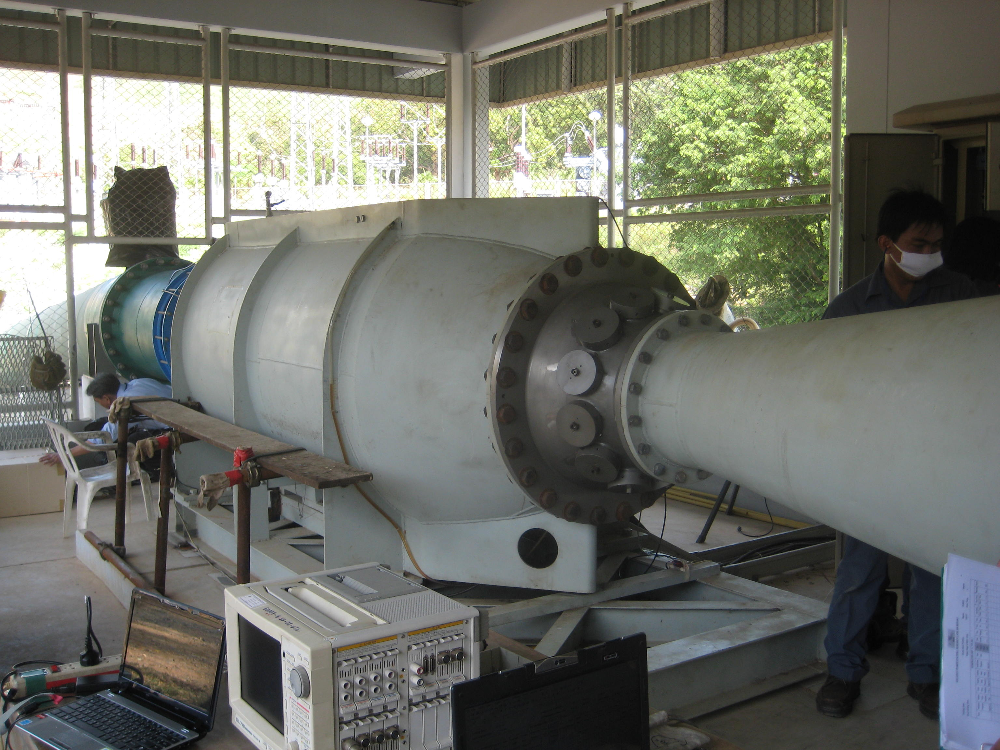

**Figure 1.** The 137 kW axial-flow bulb turbine installed on the EGAT performance test rig at the Kaeng Krachan Dam site. Flow enters from the penstock at right through the bolted-flange casing; the bulb houses the directly coupled induction generator, and the draft-tube cone extends to the left. At each operating point the discharge, the generator and mechanical power, and the guide-vane angle were recorded through the oscilloscope and data-acquisition instrumentation visible in the foreground. Bringing the rig to a stable condition and averaging repeated readings at every operating point is the labor-intensive procedure that makes each of the 72 measured points costly and motivates reducing their number.

Performance testing was carried out by EGAT's Power Plant Performance Test Department (Production Efficiency Division) on a purpose-built rig at the Kaeng Krachan Dam site, Phetchaburi Province. At each constant head the guide-vane angle was swept while the discharge and the generator and mechanical power were recorded; the overall (system) efficiency reported in the dataset is the wire-to-water efficiency, equal to the turbine mechanical efficiency multiplied by an assumed induction-generator efficiency of approximately 0.90. The dataset also records the turbine mechanical efficiency separately. At the BEP both efficiency definitions identify the same operating point, so the localization analysis that follows is unaffected by the choice between them. The efficiency magnitudes in this dataset are consistent with the source documentation once two definitional points are recognized. First, the values analyzed here are overall system (wire-to-water) efficiencies, whereas the turbine mechanical efficiencies reported for the same machine are higher: at the BEP the dataset records an overall efficiency of 0.697 and a mechanical efficiency of 0.777, the ratio being the assumed generator efficiency of about 0.90. The 78–80% figures quoted in the turbine-design literature for this machine family refer to mechanical (turbine) efficiency, which the present dataset reproduces at 0.777. Second, the source performance tests computed efficiency from inlet pressure measured at two alternative planes — before the bulb, and after the bulb just upstream of the guide vanes — giving maximum turbine efficiencies of 75.17% (at 17 m head) and 77.93% (at 16 m head, guide-vane angle 37.5°, discharge 0.82 m³/s) respectively for this 137 kW unit. These are the same measured runs evaluated across different measurement planes, not different test campaigns, and the 16 m, 37.5°, 0.82 m³/s peak coincides with the BEP identified in the present dataset. The dataset analyzed here is therefore the EGAT 137 kW small-hydro propeller turbine campaign, with efficiency computed on the after-bulb plane, the configuration that yields the higher efficiency and whose mechanical-efficiency peak of 0.777 is consistent with the 77.93% reported for that plane. The BEP of the ground-truth dataset lies at *Q* = 0.8185 m³/s, *H* = 16.00 m (guide-vane angle 37.5°), *η*\* = 0.6973, which is the point of maximum measured overall efficiency. We note here, and return to it in §6.3, that the BEP head coincides exactly with an integer head node of the test matrix; this coincidence has consequences for the comparison that must be acknowledged.

### 4.2 Gaussian-process surrogate and adaptive sampling policies

The adaptive policy is a Bayesian optimization loop built on a Gaussian process (GP) surrogate of the efficiency function [18], implemented with the scikit-learn library [28]. The GP places a prior over functions specified by a constant mean and a product covariance kernel,

> *k*(**x**, **x**′) = *C* · *k*_Matérn(**x**, **x**′; *ν* = 5/2),  **(2)**

where *C* is a constant (signal-variance) kernel and *k*_Matérn is the Matérn kernel with smoothness parameter *ν* = 5/2 and a single shared length scale. The Matérn-5/2 kernel is preferred over the squared-exponential kernel because it imposes weaker smoothness assumptions appropriate to measured data [29]. The kernel hyperparameters are obtained by maximizing the marginal likelihood with five random restarts of the optimizer; a small jitter (*α* = 1×10⁻⁶) is added to the diagonal for numerical stability, and the efficiency response is standardized internally. The surrogate takes three standardized inputs — discharge *Q*, head *H*, and guide-vane angle — and all six sampling policies use the same three inputs and GP configuration, so the comparison isolates the sampling strategy alone. The guide-vane angle is the actuated control variable in this campaign: each (*Q*, *H*) condition maps to a unique guide-vane setting — the within-head Pearson correlation between guide-vane angle and discharge, averaged over the eight test heads, is 0.986 (range 0.983–0.988) — so an operating point is fully specified by (*Q*, *H*), and the sampling policies operate in the (*Q*, *H*) plane. Reconstruction accuracy is evaluated at all 72 measured operating points, and the efficiency field is visualized on the conventional (*Q*, *H*) hill-chart plane.

Trained on the sampled set *S* with inputs *X*_S and measured efficiencies *y*_S, the GP posterior at any operating point **x** is Gaussian with closed-form mean and variance

> *μ*_S(**x**) = *m* + *k*(**x**, *X*_S) [*K*_S + *σ*ₙ² *I*]⁻¹ (*y*_S − *m*),  **(3)**
>
> *σ*²_S(**x**) = *k*(**x**, **x**) − *k*(**x**, *X*_S) [*K*_S + *σ*ₙ² *I*]⁻¹ *k*(*X*_S, **x**),  **(4)**

where *K*_S = *k*(*X*_S, *X*_S) and *σ*ₙ² is the small jitter term. The posterior mean *μ*_S is the reconstructed efficiency surface, while the posterior variance *σ*²_S is the surrogate's own admission of how uncertain it remains. Crucially, the variance in (4) depends only on the *locations* of the observations and not on their measured values, so the informativeness of a candidate operating point can be scored in closed form before the experiment is run — the property the active-learning acquisitions exploit.

The three adaptive policies (BO-UCB, ALM, and ALC) share a single greedy loop and differ only in the acquisition function *a*(**x**): (i) initialize *S* with *n*₀ points drawn at random; (ii) fit the GP on (*X*_S, *y*_S) and evaluate *μ*_S and *σ*_S from (3)–(4); (iii) select **x**_next = argmax over **x** ∈ *X* \ *S* of *a*(**x**); (iv) run the experiment, append it to *S*, and repeat (ii)–(iv) until |*S*| = *n*. The three acquisitions encode different objectives, developed next.

Given the posterior mean *μ*ₜ(**x**) and posterior standard deviation *s*ₜ(**x**) after *t* observations, BO-UCB chooses the next experiment by maximizing an upper confidence bound acquisition function over the candidate operating points,

> *a*(**x**) = *μ*ₜ(**x**) + *κ* · *s*ₜ(**x**),  *κ* = 2.0.  **(5)**

The upper-confidence-bound criterion is used because it provides an explicit and interpretable trade-off between exploiting points of high predicted efficiency (the *μ* term) and exploring points of high posterior uncertainty (the *s* term), with *κ* = 2.0 weighting exploration moderately. At each iteration the GP is refitted on all points observed so far, the acquisition function is evaluated over all not-yet-sampled operating points, and the point of maximum acquisition is selected for the next experiment, which is realized by reading the corresponding ground-truth efficiency. The loop runs, refitting the surrogate after every observation, until the experimental budget *n* is exhausted.

Two Gaussian-process active-learning policies complete the set of adaptive methods. They share the surrogate, the initialization, and the sequential loop of the Bayesian policy, and differ only in the acquisition function: whereas the UCB acquisition is built to find a maximum, the active-learning acquisitions are built to make the surrogate accurate everywhere, and the contrast between these two design intents is the methodological axis of the study. **Active Learning MacKay (ALM)** [30] selects the candidate operating point at which the posterior standard deviation is largest,

> *a*(**x**) = *s*ₜ(**x**),  **(6)**

so that each experiment removes the largest remaining pocket of predictive uncertainty. Under a Gaussian process this greedy rule maximizes the information gained about the function value at the queried point, and it tends to produce a near space-filling pattern with a mild bias toward the domain boundary, where the posterior variance is naturally highest. **Active Learning Cohn (ALC)** [31] instead selects the candidate whose observation most reduces the surrogate's integrated posterior variance over the whole candidate set,

> *a*(**x**) = −(1/*N*) Σᵢ *s*²ₜ₊**x**(**x**ᵢ),  **(7)**

where the augmented posterior variance is evaluated at each of the *N* candidate points. Because the Gaussian-process posterior variance depends only on the locations of the observations and not on their measured values, the effect of adding a candidate can be scored in closed form before the experiment is run, with the fitted kernel held fixed, at a per-step cost of *O*(*N*) candidate evaluations for ALM and UCB and *O*(*N*²) for ALC. ALC is the sequential, greedy counterpart of the integrated-mean-square-error optimal designs of classical computer-experiment theory [32].

### 4.3 Initialization

Every sequential policy (BO-UCB, ALM, and ALC) is initialized with *n*₀ = 5 operating points drawn uniformly at random, without replacement, from the measured candidate set, after which the acquisition function governs all subsequent selections. A random initial design makes the sequential policies stochastic, so their run-to-run variability is characterized across random seeds on the same footing as the random and Latin hypercube baselines (§4.5). Structured alternatives, such as the corners-and-center core of a classical central composite design, are a natural refinement; a systematic comparison of initialization schemes is identified as future work in §6.4.

### 4.4 Baseline design-of-experiments methods

Three classical, non-adaptive designs serve as baselines, each allocated the same total experimental budget *n* as the adaptive policies to ensure a fair comparison.

**Random sampling** draws *n* operating conditions without replacement from the measured points. It provides an unbiased but uncontrolled coverage of the space and serves as the minimal baseline.

**Grid sampling** constructs a regular lattice spanning the discharge and head ranges and snaps each lattice node to the nearest measured operating point, reproducing the conventional practice of testing at evenly spaced operating conditions; when the budget is not a perfect square, the selection is completed to *n* with randomly chosen unused points, so grid sampling is also mildly stochastic at such budgets.

**Latin hypercube sampling** [13] generates a two-dimensional space-filling design over the discharge–head ranges with even one-dimensional stratification, snaps each sample to the nearest measured point, and fills any shortfall with randomly chosen unused points.

For every design, the sampled conditions are evaluated against the ground-truth dataset, a surrogate is fitted to the resulting observations using the same Gaussian process specification as in §4.2 to ensure that differences in performance arise from the sampling policy and not from the interpolating model, and the fitted surrogate is used both to reconstruct the surface and to estimate the BEP. All six policies retain a stochastic element — the sequential policies through their random initialization, grid sampling through its random completion at non-square budgets, and random and Latin hypercube sampling by construction — and all are therefore evaluated across random seeds (§4.5).

### 4.5 Evaluation protocol

All policies are evaluated at a series of common budgets *n* swept from 6 to 30 experiments against the complete measured dataset of 72 points; a budget of *n* corresponds to a reduction of (72 − *n*)/72 in the number of physical experiments, from 58.3% at *n* = 30 to 91.7% at *n* = 6. The budget *n* = 12 (an 83.3% reduction) serves as the headline operating point for the tables and illustrative figures, chosen by the engineering criterion stated in §5.3.

- **Global reconstruction metrics.** The reconstructed surface is compared to the ground truth over all 72 experimental points using the mean absolute error (MAE), the root-mean-square error (RMSE), the coefficient of determination (*R²*), and the mean absolute percentage error (MAPE). These metrics rank the policies under the global-reconstruction objective; under the localization objective they are reported only to characterize each policy's behavior.
- **BEP localization metrics.** The primary metrics are the absolute errors in the predicted BEP location and value relative to ground truth: the discharge error |*Q̂* − *Q*\*|, the head error |*Ĥ* − *H*\*|, and the efficiency error |*η̂* − *η*\*|. To avoid crediting a policy merely for sampling the peak, the BEP is read from the GP prediction over the full 72-point grid, not from the sampled rows.
- **Statistical protocol.** Because every policy retains a stochastic element, all metrics are computed across 20 independent random seeds and reported as mean ± standard error; each seed fixes the random initialization of the sequential policies and the draws of the random and Latin hypercube designs. Pairwise differences between policies are tested with one-sided Wilcoxon signed-rank tests, pairing the methods on the seeds as matched replications; with 20 seeds the smallest attainable exact *p*-value is 2⁻²⁰ ≈ 10⁻⁶.
- **Budget analysis.** To quantify the achievable experiment reduction, both the global reconstruction error and the BEP localization error are reported as functions of the budget *n* over the range 6 to 30 experiments, and the smallest budget at which the Bayesian policy locates the exact BEP node on every seed is determined.

## 5. Results

The results are organized around the two objectives defined in Section 3. Section 5.1 reports global hill-chart reconstruction; Section 5.2 reports best-efficiency-point localization; Section 5.3 presents the budget sweep that is the core evidence of the study; Section 5.4 gives the significance tests; Section 5.5 examines the very-low-budget regime; Section 5.6 verifies that the surrogate's posterior uncertainty tracks its actual error; and Section 5.7 distills the findings into practical guidance for planning a reduced test campaign. All policies are averaged over 20 seeds and reported as mean ± standard error. Unless stated otherwise the illustrative budget is *n* = 12, an 83.3% reduction from the 72-point campaign (justified in Section 5.3).

### 5.1 Global hill-chart reconstruction

For recovering the entire efficiency map, the model-based active learners are the strongest methods and the optimizer is the weakest. Table 2 reports reconstruction and localization metrics for all six policies at *n* = 12. The integrated-variance active learner ALC attains the best global accuracy (*R²* = 0.9965, MAE = 0.00218, MAPE = 0.35%), with the maximum-variance learner ALM statistically indistinguishable from it (*R²* = 0.9961; the difference is not significant, Section 5.4). The space-filling designs follow (LHS *R²* = 0.9945, grid *R²* = 0.9938), while random sampling (*R²* = 0.9380) and, notably, Bayesian optimization (*R²* = 0.9207) are markedly worse. BO-UCB is the worst map-builder of the six: by design it concentrates its budget near the predicted optimum and starves the rest of the domain, so its surrogate is accurate near the peak but biased elsewhere — the expected behavior of an optimization acquisition applied to a reconstruction task. Figure 4 shows the reconstructed hill chart obtained by each of the six policies at *n* = 12, and Figure 5 presents the same reconstructions as three-dimensional efficiency surfaces at a shared viewing angle. Figure 6 maps the absolute reconstruction error for each policy over the operating plane, and Figure 7 presents the same error as three-dimensional surfaces, on which the tall error ridge over the low-efficiency, high-discharge corner produced by random sampling and BO-UCB is immediately visible. Figure 8 then contrasts where each policy places its 12 experiments. Across these views the active learners and space-filling designs cover the whole envelope, whereas BO-UCB leaves the low-efficiency, high-discharge corner sparse and reconstructs it poorly.

**Table 2. Reconstruction and BEP-localization metrics at *n* = 12 (83.3% reduction), mean over 20 seeds.** Best value in each column in bold. Reconstruction: lower MAE/RMSE/MAPE and higher *R²* are better. Localization: lower Δ*Q*/Δ*H*/Δ*η* are better.

| Method | MAE | RMSE | *R²* | MAPE (%) | Δ*Q* | Δ*H* | Δ*η* |
|---|---|---|---|---|---|---|---|
| ALC | **0.00218** | **0.00354** | **0.9965** | **0.35** | 0.0235 | 0.50 | 0.00714 |
| ALM | 0.00239 | 0.00380 | 0.9961 | 0.38 | 0.0131 | 0.75 | 0.01015 |
| LHS | 0.00272 | 0.00445 | 0.9945 | 0.44 | 0.0215 | 0.80 | 0.00748 |
| Grid | 0.00313 | 0.00476 | 0.9938 | 0.50 | **0.0108** | 0.70 | 0.01131 |
| Random | 0.00609 | 0.00988 | 0.9380 | 1.07 | 0.0230 | 0.55 | 0.00861 |
| BO-UCB | 0.00986 | 0.01577 | 0.9207 | 1.77 | 0.0137 | **0.00** | **0.00030** |

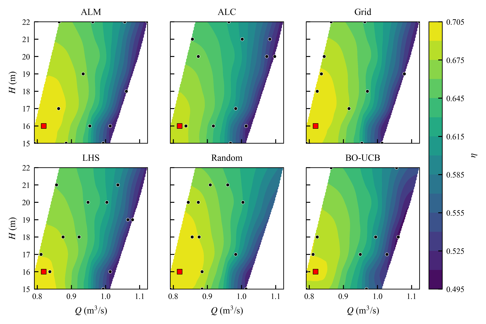

**Figure 4.** Reconstructed hill-chart contours at *n* = 12 for all six policies (the 12 sampled points in black, the true BEP marked by a red square). The active learners and space-filling designs recover the whole surface, whereas BO-UCB distorts the low-efficiency, high-discharge region.

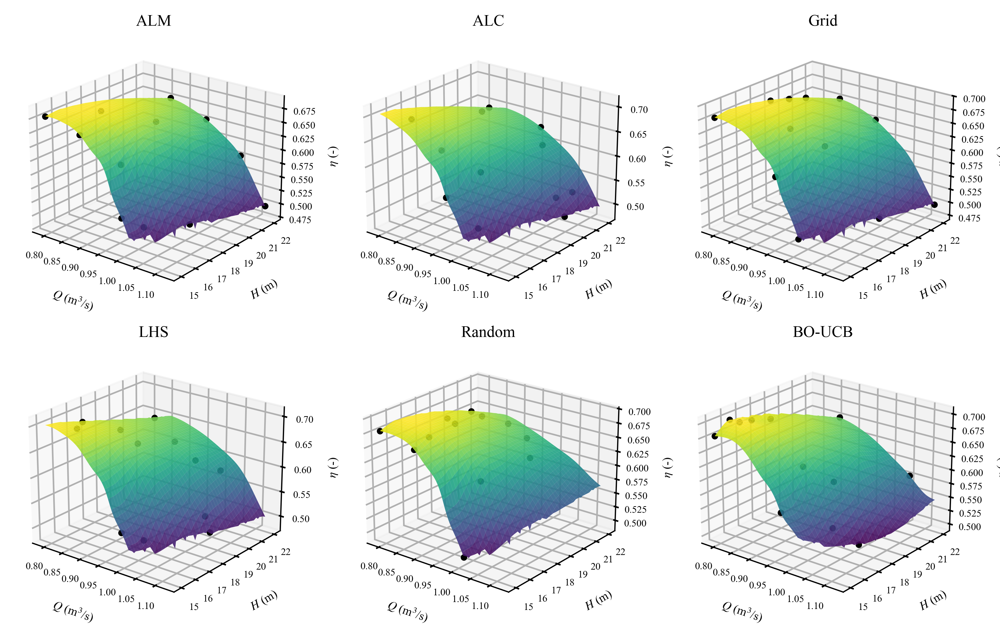

**Figure 5.** Reconstructed efficiency surfaces at *n* = 12 for all six policies, rendered at the shared viewing angle used throughout for comparability. Sampled points are shown in black.

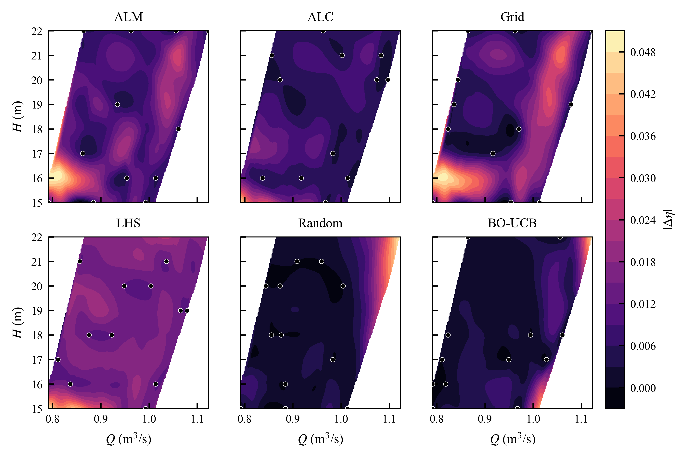

**Figure 6.** Absolute reconstruction error |Δ*η*| at *n* = 12 for all six policies. The error concentrates where a policy leaves the operating envelope sparsely sampled.

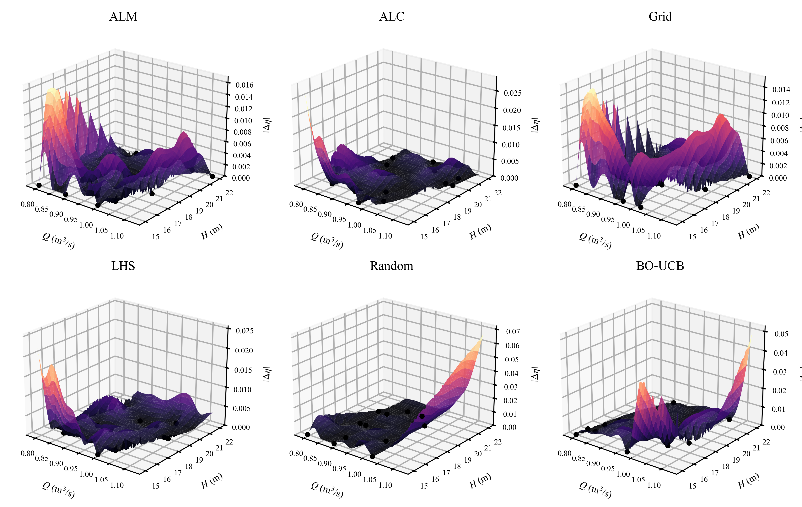

**Figure 7.** Absolute reconstruction error |Δ*η*| at *n* = 12 for all six policies as three-dimensional surfaces (the companion to Figure 6). The vertical scale exposes how much larger the peak error is for random sampling and BO-UCB — a tall ridge over the low-efficiency, high-discharge corner — than for the active learners and space-filling designs.

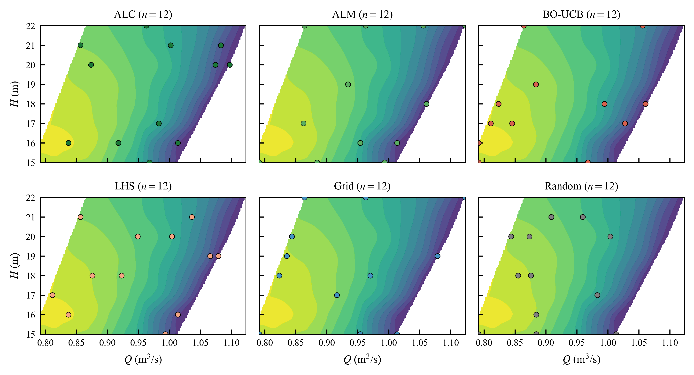

**Figure 8.** Sample placement at *n* = 12 for all six policies over the ground-truth efficiency contour: the active learners and space-filling designs cover the envelope, whereas BO-UCB concentrates on the high-efficiency ridge.

### 5.2 Best-efficiency-point localization

For the opposite objective — pinpointing the BEP — the ranking inverts. The rightmost columns of Table 2 report the localization errors, and here Bayesian optimization is decisively best: at *n* = 12 it already matches the ground-truth head exactly (Δ*H* = 0) and reaches an efficiency error Δ*η* = 0.0003, one to two orders of magnitude below every other method (Δ*η* between 0.007 and 0.011 for the active learners and space-filling designs). By *n* = 14 the UCB policy locates the exact BEP node, with discharge, head, and efficiency error all at the level of numerical noise (Δ*η* → 0). This follows directly from the exploitation term of the UCB acquisition: it climbs the efficiency ridge and expends its budget resolving the peak — exactly what BEP localization rewards and exactly what penalized it on the global metric. The active learners and space-filling designs, spreading their budget for coverage, never resolve the optimum as sharply and plateau near 10⁻². Figure 9 juxtaposes the two behaviors at the same budget in a single frame.

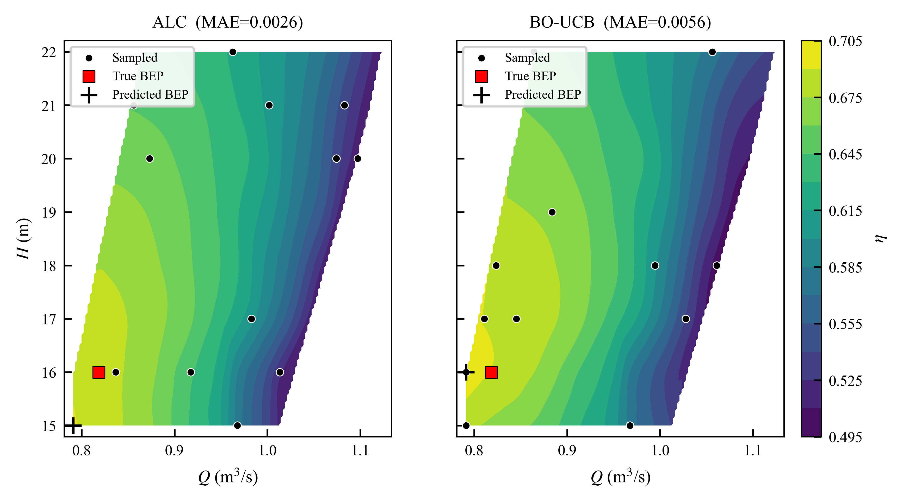

**Figure 9.** The two goals in one frame: ALC (left) and BO-UCB (right) at the same budget *n* = 12. BO-UCB pins the BEP but distorts the map; ALC recovers the map but locates the BEP less precisely. This contrast is the thesis of the paper: the acquisition function must match the deliverable.

### 5.3 Experiment budget versus accuracy

The central evidence of the study is the budget sweep in Figure 10, which reports both objectives as a function of the number of experiments *n* from 6 to 30. For reconstruction (panel a) the active learners reach engineering-grade accuracy very early: ALC attains *R²* = 0.994 by *n* = 10 and *R²* = 0.996 by *n* = 12, and ALM tracks it closely, while BO-UCB never exceeds *R²* ≈ 0.96 anywhere in the range. For localization (panel b) BO-UCB drives the BEP efficiency error to 0.0003 by *n* = 12 and to the level of numerical noise (below 4×10⁻⁶) by *n* = 14, whereas the other methods remain near 10⁻² throughout. At large budgets (*n* ≥ 25) all reconstruction methods saturate above *R²* = 0.99 and the differences vanish; the value of the comparison is visible only in the low-budget regime, which is precisely where experiments are scarce.

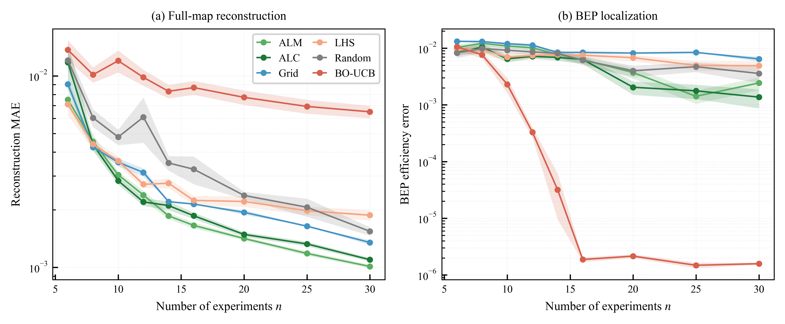

**Figure 10.** Learning curves over the budget sweep (mean ± standard error, 20 seeds). (a) Global reconstruction versus *n*: the active learners (ALC, ALM) dominate and BO-UCB is worst. (b) BEP efficiency error versus *n*: BO-UCB dominates, reaching the level of numerical noise by *n* = 14, while the others plateau. The inversion between the panels is the core result.

This motivates *n* = 12 as the headline budget for the illustrative figures, chosen by an explicit engineering criterion — the smallest budget at which the recommended reconstruction method reaches *R²* ≥ 0.99 and MAPE < 0.5% — rather than by inspection. ALC clears this bar at *n* = 10 (*R²* = 0.994, MAPE = 0.46%) and ALM at *n* = 12 (*R²* = 0.996, MAPE = 0.38%); we adopt *n* = 12, the conservative point at which both recommended learners clear the bar, an 83.3% reduction from the full campaign.

The headline reduction result follows directly. For the full hill chart, active learning attains *R²* ≈ 0.996 from just 12 of the 72 measured points — an 83% reduction — and reaches *R²* ≥ 0.99 from as few as 10 points. For the BEP alone, Bayesian optimization identifies the exact optimum node using 14 experiments, an 81% reduction. In both cases the deliverable is obtained at well under a quarter of the original test effort, provided the sampling policy is matched to the objective.

### 5.4 Statistical significance

Because these averages could reflect seed-to-seed luck, each headline claim is tested with a Wilcoxon signed-rank test, pairing methods on the 20 seeds as matched replications (Table 3). For reconstruction (reference ALC at *n* = 12) ALC significantly outperforms BO-UCB (*p* ≈ 10⁻⁶), random (*p* ≈ 10⁻⁵), grid (*p* = 1.3×10⁻⁴) and LHS (*p* = 0.009), while the ALC–ALM difference is not significant (*p* = 0.09): the two active learners are statistically equivalent. For localization (reference BO-UCB at *n* = 12) BO-UCB beats every other method on efficiency error at *p* ≤ 4.8×10⁻⁶, at or near the smallest *p* attainable with 20 seeds, a floor small enough that its localization advantage is unambiguous. Read across budgets, ALC and ALM significantly beat BO-UCB and random at essentially every *n* ≥ 8 and beat grid and LHS from *n* = 12 upward; the ALM–ALC difference is never significant, so we recommend ALM as the practical default for reconstruction — equal accuracy at lower computational cost. Figure 11 visualizes the ranking inversion between the two objectives at *n* = 12.

**Table 3. Wilcoxon signed-rank tests at *n* = 12 (20 seeds, paired by seed).** Top: reconstruction MAE, reference ALC. Bottom: BEP efficiency error, reference BO-UCB. *p* < 0.05 is significant.

| Comparison | Metric | *p*-value | Significant? |
|---|---|---|---|
| ALC vs. ALM | MAE | 0.09 | no (equivalent) |
| ALC vs. LHS | MAE | 0.009 | yes |
| ALC vs. Grid | MAE | 1.3×10⁻⁴ | yes |
| ALC vs. Random | MAE | 1.3×10⁻⁵ | yes |
| ALC vs. BO-UCB | MAE | 9.5×10⁻⁷ | yes |
| BO-UCB vs. ALC | Δ*η* | 9.5×10⁻⁷ | yes |
| BO-UCB vs. ALM | Δ*η* | 9.5×10⁻⁷ | yes |
| BO-UCB vs. LHS | Δ*η* | 4.8×10⁻⁶ | yes |
| BO-UCB vs. Grid | Δ*η* | 9.5×10⁻⁷ | yes |
| BO-UCB vs. Random | Δ*η* | 9.5×10⁻⁷ | yes |

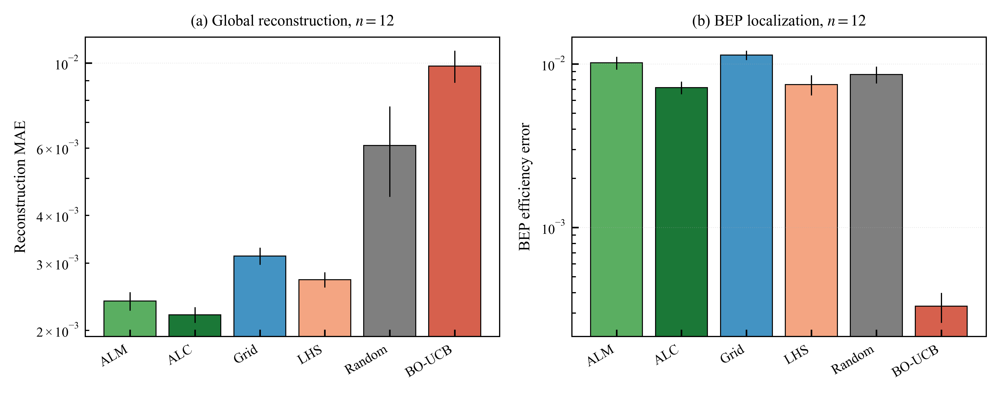

**Figure 11.** Method ranking at *n* = 12 with standard-error bars. (a) Reconstruction: active learners best. (b) BEP localization: BO-UCB best. The ranking inverts between the two objectives.

### 5.5 The very-low-budget regime

One qualification bounds the recommendation. Below about eight experiments the Gaussian process is fitted on too few points for the model-based acquisitions to be reliable, and the integrated-variance learner in particular can degrade: at *n* = 6, ALC drops to *R²* = 0.82 and BO-UCB to *R²* = 0.84, whereas the space-filling and maximum-variance designs remain robust (LHS *R²* = 0.97, grid *R²* = 0.96, ALM *R²* = 0.97). In this extreme-reduction corner a model-free space-filling design is the safer choice. The practical guidance is therefore tiered: use Latin hypercube sampling for the smallest budgets (*n* < 8) and switch to active learning (ALM or ALC) once *n* ≥ 10, where it reliably dominates. For BEP localization the recommendation is unqualified across the range examined: Bayesian optimization is preferred at every budget.

In summary, the six policies separate cleanly into three groups matched to purpose: the active learners (ALC, ALM) for reconstructing the whole hill chart, Bayesian optimization for locating the BEP, and space-filling designs (chiefly LHS) as the robust fallback at the very lowest budgets. Both recommended tools are data-driven and share the same surrogate, so the practical cost of choosing the sampler to match the objective is negligible.

### 5.6 Posterior uncertainty as a stopping signal

The adaptive stopping rule discussed in §6.2 is viable only if the surrogate's own uncertainty is informative about its actual error. Figure 12 compares the Gaussian-process posterior standard deviation *σ* with the absolute reconstruction error |Δ*η*| for the ALC design at *n* = 12 (seed 0). The two fields share the same spatial structure: both attain their largest values in the sparsely sampled low-discharge, low-head corner of the envelope and both are small throughout the well-covered interior. The agreement is quantitative as well as visual, with a Pearson correlation of *r* = 0.70 between *σ* and |Δ*η*| at the 72 measured points (*p* < 10⁻¹¹). The posterior uncertainty is therefore a usable running proxy for where, and by how much, the reconstruction remains untrustworthy, which is precisely the property an uncertainty-based stopping criterion relies on.

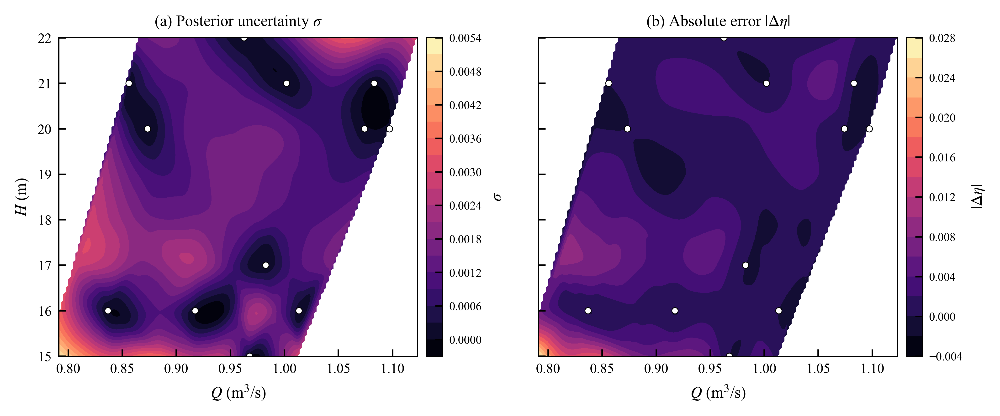

**Figure 12.** Gaussian-process posterior uncertainty *σ* (a) and absolute reconstruction error |Δ*η*| (b) for the ALC design at *n* = 12 (seed 0), with the 12 sampled points marked. The two fields are strongly correlated (Pearson *r* = 0.70 at the 72 measured points), supporting the use of posterior uncertainty as a stopping signal.

### 5.7 Practical guidance: choosing the budget and the sampler

The preceding results translate into a compact recipe that an engineer can apply before a campaign begins, summarized in Table 4. The decision has two inputs: the deliverable (the full hill chart or only the BEP) and the budget the campaign can afford. For the common deliverable — the full hill chart — the sweet spot is *n* = 10 to 12 experiments, an 86% to 83% reduction from the 72-point campaign. This is the smallest budget at which the active learners reach engineering-grade accuracy (*R²* ≥ 0.99, MAPE < 0.5%) while remaining clear of the *n* < 8 regime in which the Gaussian process is fitted on too few points to be reliable (Section 5.5); we recommend *n* = 12 as the conservative default and *n* = 10 when experiments are especially scarce. Below eight experiments, where a model-based policy cannot yet be trusted, a space-filling Latin hypercube design is the safer choice and still recovers the surface to *R²* ≈ 0.97 at an 89% to 92% reduction. If the deliverable is only the BEP, 14 experiments (an 81% reduction) with BO-UCB are sufficient to locate the exact optimum node. Because ALM and ALC are statistically indistinguishable for reconstruction (Section 5.4), we recommend ALM as the default reconstruction sampler on the grounds of lower computational cost. Two caveats travel with the table: the budgets are calibrated on a smooth, unimodal low-head propeller hill chart and should be revisited for machines with more structured efficiency surfaces, and the very-low-budget recommendation assumes the practitioner cannot afford the space-filling initialization that would stabilize a model-based policy.

**Table 4. Practical guidance for a reduced test campaign on a smooth low-head propeller hill chart.** Reduction is relative to the 72-point reference campaign; accuracy figures are the mean over 20 seeds.

| Deliverable | Recommended sampler | Budget *n* | Reduction | Expected accuracy |
|---|---|---|---|---|
| Full hill chart (default) | ALM (or ALC) | 12 | 83% | *R²* ≈ 0.996, MAPE 0.38% |
| Full hill chart (aggressive) | ALC | 10 | 86% | *R²* ≈ 0.99, MAPE < 0.5% |
| Full hill chart (extreme, model-free) | LHS | 6–8 | 89–92% | *R²* ≈ 0.97 |
| Best efficiency point only | BO-UCB | 14 | 81% | exact BEP node, Δ*η* → 0 |

## 6. Discussion and Conclusion

### 6.1 Interpreting the exploitation advantage

The central finding of this study is that the policy ranked worst by global surface-reconstruction metrics is the best for locating the best efficiency point, and that this is not a contradiction but a direct and predictable consequence of how an exploitation-driven adaptive policy allocates a limited budget. Bayesian optimization with an upper-confidence-bound criterion concentrates experiments near the apparent optimum and along the high-efficiency ridge, and declines to sample the low-efficiency, high-discharge corner (Figure 8). That corner is therefore reconstructed poorly, which inflates global error statistics, while the peak region is resolved essentially exactly, which is what the localization metrics reward: from 14 experiments the policy identifies the exact BEP node on every seed. The active learners exhibit the mirror-image behavior: by directing their budget at the surrogate's remaining uncertainty they reconstruct the whole surface accurately, including the parts of it that no operator cares about, but they never place enough experiments at the peak to resolve the optimum sharply, and their localization error plateaus near 10⁻². The methodological lesson is that the success criterion must match the decision objective. A study that adopts the global coefficient of determination as its headline metric will rank the active learners and space-filling designs first and dismiss the adaptive optimizer, and will thereby recommend a test plan optimized for a goal — uniform global fidelity — that a BEP-directed engineer did not actually have. When the goal is BEP identification, the appropriate criteria are localization accuracy and reliability, and under those criteria the optimization policy is decisively preferred. This realignment of metric to objective, rather than any single numerical result, is the contribution most likely to transfer to other turbine performance-testing campaigns.

### 6.2 Decision-support implications

Framing performance testing as sequential decision-making yields a practical benefit beyond the choice of sampling policy. Because the Gaussian process surrogate reports a posterior uncertainty that demonstrably tracks the actual reconstruction error (§5.6, Figure 12), it provides the engineer with a running estimate of confidence in the current map and, in particular, in the estimated BEP. This supports an adaptive stopping rule: testing can continue until the posterior uncertainty in the high-efficiency region, or the acquisition value available from a further experiment, falls below a threshold the engineer is willing to accept, rather than until a pre-committed number of points has been measured. The budget sweep suggests that such a rule would have terminated testing at roughly 14 experiments for a BEP-directed campaign on the present machine, and at 10 to 12 experiments for hill-chart reconstruction, against the 72 of the full campaign. The non-adaptive designs cannot support such a rule, because they do not use the observed efficiencies to guide sampling: their sample locations are fixed before any data are seen and cannot respond to where the surrogate remains most uncertain. In a setting where each experiment is genuinely expensive, the ability to decide when to stop on a principled basis is as valuable as the ability to decide where to test next, and both follow from the decision-theoretic framing adopted here.

### 6.3 Limitations

Several limitations bound the conclusions of this study. First, the ground-truth BEP head coincides exactly with an integer head node of the test matrix. This coincidence favors any policy that samples that node and contributes to the exact BEP recovery reported for the Bayesian policy; a perturbation analysis in which the BEP is defined on a continuous interpolant, or in which the test grid is offset, would establish how much of the localization advantage survives when the optimum does not lie on a node. Second, the near-zero localization error of the Bayesian policy reflects direct measurement of the peak region rather than superior out-of-sample interpolation there: the policy spends its budget inside the high-efficiency envelope, and its advantage should be understood accordingly. Third, all sequential policies are initialized at random, and below about eight experiments the Gaussian process is fitted on too few points for the model-based acquisitions to be reliable (§5.5); a structured initialization, such as the corners-and-center core of a central composite design, might improve this very-low-budget behavior and remains to be compared systematically. Fourth, the study concerns one machine and one measured dataset, so the generality of the finding across other propeller turbines, other turbine types, and other operating envelopes is not established. None of these limitations undermines the qualitative finding, but each constrains how strongly it can be stated.

### 6.4 Conclusion and future work

This paper has formulated the construction of a small-hydro propeller-turbine performance map from physical experiments as a sequential, budget-constrained decision problem, and has benchmarked six sampling policies — Bayesian optimization, two Gaussian-process active-learning policies, and random, grid, and Latin hypercube designs — on a measured ground-truth dataset of 72 points, with the best efficiency point as an explicit decision target. The study finds that the two engineering objectives select opposite winners. For reconstructing the full hill chart, the active learners dominate, reaching *R²* ≥ 0.99 from as few as 10 experiments and *R²* ≈ 0.996 from 12 (an 83.3% reduction), while the optimization policy is the weakest map-builder. For locating the BEP the ranking inverts: Bayesian optimization identifies the exact BEP node on every seed from 14 experiments (an 81% reduction), while every other policy plateaus near Δ*η* ≈ 10⁻². The practical implication is that turbine performance testing should be planned as a targeted decision process whose sampling policy — and whose success metric — matches the deliverable: active learning when the deliverable is the hill chart, Bayesian optimization when it is the BEP, and a space-filling design as the robust fallback at the very smallest budgets. For the practitioner these findings reduce to a concrete budget recipe (Table 4): the hill chart is recovered at the sweet spot of 10 to 12 experiments (an 83% to 86% reduction) and the BEP at 14 experiments (an 81% reduction), with Latin hypercube sampling as the safe choice below eight experiments. Although demonstrated on a single small-hydro propeller turbine, the sequential-decision framing is not specific to this machine: objective-directed adaptive sampling has been applied to the optimization of other small-scale energy-conversion devices [33], and the present results suggest that comparable budget savings should transfer to any expensive performance-mapping campaign in which the deliverable is well defined.

Future work should test the sensitivity of the result to the placement of the BEP relative to the test grid, compare structured initialization schemes against the random initialization used here, examine the robustness of the ranking to the choice of GP kernel, and extend the comparison to a second measured dataset, other turbine types, and other operating envelopes. Incorporating additional decision objectives — such as the joint consideration of efficiency and cavitation margin — within the same sequential-decision framework, and integrating a principled stopping rule based on posterior uncertainty into a live test campaign, are promising directions for reducing the cost of turbine performance characterization in practice.

## Acknowledgements

The authors gratefully acknowledge the Electricity Generating Authority of Thailand (EGAT), and in particular its Power Plant Performance Test Department, for conducting the propeller-turbine performance tests at the Kaeng Krachan site and for making the resulting experimental data available for this study. The authors also thank Kasetsart University, Sriracha Campus, and Rambhai Barni Rajabhat University for their institutional and technical support throughout the work.

## Conflict of Interest

The authors declare that they have no known competing financial interests or personal relationships that could have appeared to influence the work reported in this paper.

## Declaration of generative AI in scientific writing

During the preparation of this work, the authors used Claude (Anthropic) as a coding assistant to implement the analysis pipeline, generate the figures, and refine the language of the manuscript. The research idea, problem formulation, methodology, and all interpretations and conclusions are the authors' own. Every AI-assisted output was reviewed, verified, and edited by the authors, who take full responsibility for the content and integrity of the work.

## CRediT Author Contribution Statement

**Siwakorn Suprasertchai:** Conceptualization, Methodology, Software, Validation, Visualization, Project administration. **Kornpaphop Ruttanawijit:** Data Curation, Writing – Original Draft. **Yodchai Tiaple:** Conceptualization, Writing – Review & Editing, Methodology, Supervision, Funding acquisition, Project administration.

## References

1. D. Zhou, Z. (Daniel) Deng, Ultra-low-head hydroelectric technology: A review, *Renewable and Sustainable Energy Reviews* 78 (2017) 23–30. https://doi.org/10.1016/j.rser.2017.04.086
2. S. Phitaksurachai, R. Pan-Aram, N. Sritrakul, Y. Tiaple, Performance Testing of Low Head Small Hydro Power Development in Thailand, *Energy Procedia* 138 (2017) 1140–1146. https://doi.org/10.1016/j.egypro.2017.10.221
3. International Electrotechnical Commission, IEC 60193:2019 Hydraulic Turbines, Storage Pumps and Pump-Turbines — Model Acceptance Tests, Geneva, 2019.
4. Z. Masood, S. Khan, L. Qian, Machine learning-based surrogate model for accelerating simulation-driven optimisation of hydropower Kaplan turbine, *Renewable Energy* 173 (2021) 827–848. https://doi.org/10.1016/j.renene.2021.04.005
5. F. Besni, F. Büyüksolak, E. Ayli, K. Celebioglu, S. Aradag, Y. Tascioglu, Machine learning-based efficiency prediction of Francis type hydraulic turbines through comprehensive performance testing, *Proc. IMechE Part A: J. Power and Energy* 239 (2025) 755–775. https://doi.org/10.1177/09576509251352663
6. J. Betancour, F. Romero-Menco, L. Velásquez, A. Rubio-Clemente, E. Chica, Design and optimization of a runner for a gravitational vortex turbine using the response surface methodology and experimental tests, *Renewable Energy* 210 (2023) 306–320. https://doi.org/10.1016/j.renene.2023.04.045
7. A. Telikani, M. Rossi, N. Khajehali, M. Renzi, Pumps-as-Turbines' (PaTs) performance prediction improvement using evolutionary artificial neural networks, *Applied Energy* 330 (2023) 120316. https://doi.org/10.1016/j.apenergy.2022.120316
8. W. Yu, P. Zhou, Z. Miao, H. Zhao, J. Mou, W. Zhou, Energy performance prediction of pump as turbine (PAT) based on PIWOA-BP neural network, *Renewable Energy* 222 (2024) 119873. https://doi.org/10.1016/j.renene.2023.119873
9. S.M. Malakouti, Use machine learning algorithms to predict turbine power generation to replace renewable energy with fossil fuels, *Energy Exploration & Exploitation* 41 (2023) 836–857. https://doi.org/10.1177/01445987221138135
10. Z. Zou, P. Xu, Y. Chen, L. Yao, C. Fu, Application of artificial intelligence in turbomachinery aerodynamics: progresses and challenges, *Artificial Intelligence Review* 57 (2024) 222. https://doi.org/10.1007/s10462-024-10867-3
11. S.S. Talebi, A. Madadi, A.M. Tousi, M. Kiaee, Micro Gas Turbine fault detection and isolation with a combination of Artificial Neural Network and off-design performance analysis, *Engineering Applications of Artificial Intelligence* 113 (2022) 104900. https://doi.org/10.1016/j.engappai.2022.104900
12. G.E.P. Box, K.B. Wilson, On the Experimental Attainment of Optimum Conditions, *J. Royal Statistical Society Series B* 13 (1951) 1–38. https://doi.org/10.1111/j.2517-6161.1951.tb00067.x
13. M.D. McKay, R.J. Beckman, W.J. Conover, Comparison of Three Methods for Selecting Values of Input Variables in the Analysis of Output from a Computer Code, *Technometrics* 21 (1979) 239–245. https://doi.org/10.1080/00401706.1979.10489755
14. J. Taghinezhad, S. Abdoli, V. Silva, S. Sheidaei, R. Alimardani, E. Mahmoodi, Computational fluid dynamic and response surface methodology coupling: A new method for optimization of the duct to be used in ducted wind turbines, *Heliyon* 9 (2023) e17057. https://doi.org/10.1016/j.heliyon.2023.e17057
15. P. Borisut, A. Nuchitprasittichai, Adaptive Latin Hypercube Sampling for a Surrogate-Based Optimization with Artificial Neural Network, *Processes* 11 (2023) 3232. https://doi.org/10.3390/pr11113232
16. D.R. Jones, M. Schonlau, W.J. Welch, Efficient Global Optimization of Expensive Black-Box Functions, *J. Global Optimization* 13 (1998) 455–492. https://doi.org/10.1023/A:1008306431147
17. B. Shahriari, K. Swersky, Z. Wang, R.P. Adams, N. De Freitas, Taking the Human Out of the Loop: A Review of Bayesian Optimization, *Proceedings of the IEEE* 104 (2016) 148–175. https://doi.org/10.1109/JPROC.2015.2494218
18. C.E. Rasmussen, C.K.I. Williams, Gaussian Processes for Machine Learning, MIT Press, 2006. https://doi.org/10.7551/mitpress/3206.001.0001
19. N. Srinivas, A. Krause, S.M. Kakade, M.W. Seeger, Information-Theoretic Regret Bounds for Gaussian Process Optimization in the Bandit Setting, *IEEE Trans. Information Theory* 58 (2012) 3250–3265. https://doi.org/10.1109/TIT.2011.2182033
20. J. Snoek, H. Larochelle, R.P. Adams, Practical Bayesian Optimization of Machine Learning Algorithms, in: *NeurIPS 25*, 2012, pp. 2951–2959.
21. S. Greenhill, S. Rana, S. Gupta, P. Vellanki, S. Venkatesh, Bayesian Optimization for Adaptive Experimental Design: A Review, *IEEE Access* 8 (2020) 13937–13948. https://doi.org/10.1109/ACCESS.2020.2966228
22. Q. Liang et al., Benchmarking the performance of Bayesian optimization across multiple experimental materials science domains, *npj Computational Materials* 7 (2021) 188. https://doi.org/10.1038/s41524-021-00656-9
23. J. Chen, C. Liu, Efficient one-dimensional turbomachinery design method based on transfer learning and Bayesian optimization, *SN Applied Sciences* 4 (2022) 255. https://doi.org/10.1007/s42452-022-05132-7
24. R.-L. Liu, Q. Zhao, X.-J. He, X.-Y. Yuan, W.-T. Wu, M.-Y. Wu, Airfoil optimization based on multi-objective bayesian, *J. Mechanical Science and Technology* 36 (2022) 5561–5573. https://doi.org/10.1007/s12206-022-1020-y
25. S. Lim, A. Garbo, P. Bekemeyer, C. Appel, R. Ewert, J. Delfs, High-fidelity Aerodynamic and Aeroacoustic Multi-Objective Bayesian Optimization, in: *AIAA AVIATION 2022 Forum*, 2022. https://doi.org/10.2514/6.2022-3354
26. L. Pretsch, I. Arsenyev, N. Bartoli, F. Duddeck, Bayesian optimization of cooperative components for multi-stage aero-structural compressor blade design, *Structural and Multidisciplinary Optimization* 68 (2025) 84. https://doi.org/10.1007/s00158-025-03998-w
27. Y. Guo, P. Nath, S. Mahadevan, P. Witherell, Active learning for adaptive surrogate model improvement in high-dimensional problems, *Structural and Multidisciplinary Optimization* 67 (2024) 122. https://doi.org/10.1007/s00158-024-03816-9
28. F. Pedregosa et al., Scikit-learn: Machine Learning in Python, *J. Machine Learning Research* 12 (2011) 2825–2830.
29. P.S. Palar, L.R. Zuhal, K. Shimoyama, Gaussian Process Surrogate Model with Composite Kernel Learning for Engineering Design, *AIAA Journal* 58 (2020) 1864–1880. https://doi.org/10.2514/1.J058807
30. D.J.C. MacKay, Information-Based Objective Functions for Active Data Selection, *Neural Computation* 4 (1992) 590–604. https://doi.org/10.1162/neco.1992.4.4.590
31. D.A. Cohn, Z. Ghahramani, M.I. Jordan, Active Learning with Statistical Models, *J. Artificial Intelligence Research* 4 (1996) 129–145. https://doi.org/10.1613/jair.295
32. J. Sacks, W.J. Welch, T.J. Mitchell, H.P. Wynn, Design and Analysis of Computer Experiments, *Statistical Science* 4 (1989) 409–423. https://doi.org/10.1214/ss/1177012413
33. Z. Sefidgar, A. Ashrafizadeh, A. Arabkoohsar, Techno-Economic Analysis and Multi-Objective Optimization of Cross-Flow Wind Turbines for Smart Building Energy Systems, *Global Challenges* 7 (2023) 2200203. https://doi.org/10.1002/gch2.202200203
